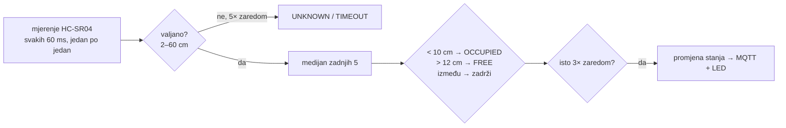

# Senzori parkirnih mjesta i firmware

Zaduženi: Toma Burgund (vlasnik) i Lovro Gale (pomoć).

## Što je već napravljeno

| | sadržaj |
|---|---|
| [firmware/](firmware) | PlatformIO projekt za ESP32: 6× HC-SR04, filtar, MQTT, Wi-Fi/MQTT reconnect, Last Will, heartbeat, NTP, LED traka, simulacijski način, serijske naredbe |
| [firmware/lib/OccupancyFilter](firmware/lib/OccupancyFilter) | filtar zauzetosti (medijan 5, histereza, potvrda 3×, neispravan senzor → `UNKNOWN`), čisti C++ |
| [firmware/test/](firmware/test/test_filter/test_main.cpp) | unit testovi filtra na PC-u, uključujući kriterij "20× bez treperenja" |
| [simulator/spot_simulator.py](simulator/spot_simulator.py) | šalje iste poruke kao ESP32, pa ostali rade bez tvog hardvera |
| [tools/kalibracija.py](tools/kalibracija.py) | iz stvarnih mjerenja predlaže pragove za svako mjesto i ispisuje redke za `config.h` |
| [tools/provjera_20x.py](tools/provjera_20x.py) | vodi te kroz test 20× postavi/makni po mjestu i piše testni zapis |
| [tablica-pragova.md](../../PROJEKT/testiranje/tablica-pragova.md) | predložak tablice pragova (isporučivo) |

Firmware je preveden i testovi filtra prolaze, ali na pravom hardveru još nije isproban. To je tvoj prvi zadatak.

## Kako radi


```mermaid
flowchart LR
  M[mjerenje HC-SR04<br/>svakih 60 ms, jedan po jedan] --> V{valjano?<br/>2–60 cm}
  V -- ne, 5× zaredom --> U[UNKNOWN / TIMEOUT]
  V -- da --> MED[medijan zadnjih 5]
  MED --> H{< 10 cm → OCCUPIED<br/>> 12 cm → FREE<br/>između → zadrži}
  H --> C{isto 3× zaredom?}
  C -- da --> P[promjena stanja → MQTT + LED]
```

Stanje mjesta ide na `garage/parking/spot/P0x/telemetry` (retained) kad se promijeni, svakih 30 s i nakon svakog
ponovnog spajanja. Oblik poruke je u [komunikacijskom ugovoru](../../PROJEKT/sustav/komunikacijski-ugovor.md#stanje-parkirnog-mjesta).

## Brzi start

1. Instaliraj [VS Code + PlatformIO](https://platformio.org/install/ide?install=vscode).
2. Kopiraj `firmware/include/secrets.example.h` u `secrets.h` i upiši Wi-Fi i IP edge računala.
3. Spoji jedan HC-SR04 prema [shemi](../../PROJEKT/maketa/shema-spajanja.md). ECHO ide preko djelitelja 1k/2k!
4. `pio run -t upload -d firmware`, zatim `pio device monitor -d firmware`.
5. U serijskom monitoru: `status`, `cal` (sirova mjerenja), `sim 3 1` (simuliraj zauzeto P03), `sim off`.
6. Na laptopu `python -m garage_contract.monitor` mora prikazati zelene poruke.

Unit testovi filtra, bez pločice: `pio test -e native -d firmware`.

## Kalibracija pragova

```bash
pip install pyserial
python tools/kalibracija.py --port COM5        # Linux: /dev/ttyUSB0
```

Prati upute: sva mjesta prazna, zatim autić na svakom mjestu. Alat ispiše tablicu za
[tablica-pragova.md](../../PROJEKT/testiranje/tablica-pragova.md) i redke za `SPOTS[]` u `firmware/include/config.h`.
"PROVJERITI montažu" znači da senzor nije okomit, vidi zid ili je razlika premala.

## Test prihvaćanja

```bash
python tools/provjera_20x.py --all --cycles 20 --out testni-zapis.md
```

Alat govori kad staviti i maknuti autić i broji promjene stanja. Test prolazi s 20/20 ciklusa i točno 40 promjena po
mjestu; svaka dodatna promjena je treperenje. Zapis predaj Lovri.

## Simulacija (za ostale članove)

```bash
python simulator/spot_simulator.py            # tipkaj "3" za promjenu P03, "3x" za kvar senzora
python simulator/spot_simulator.py --random 20
```

## Zadaci

- ✅ ESP32 firmware napisan i preveden · ⬜ isprobati na hardveru
- ✅ shema spajanja (`SOFTWARE/maketa/elektronika`)
- ✅ MQTT poruke za sva mjesta prema ugovoru, simulator za usporedbu
- ⬜ jedan senzor s djeliteljem i stabilna mjerenja u serijskom monitoru (KT2)
- ⬜ svih 6 senzora na maketi (s Patrikom i Lovrom), kalibracija, pragovi u `config.h` i `tablica-pragova.md`
- ⬜ MQTT s pravim brokerom, provjera monitorom, LED traka
- ⬜ test 20× za svako mjesto (`provjera_20x.py`) i testni zapis
- ⬜ testovi oporavka: isključi Wi-Fi router ili Mosquitto, ESP32 se mora sam vratiti i ponovno poslati stanja
- ⬜ po potrebi rezervni senzor (IR ili VL53L0X) ako HC-SR04 na nekom mjestu ne radi pouzdano
